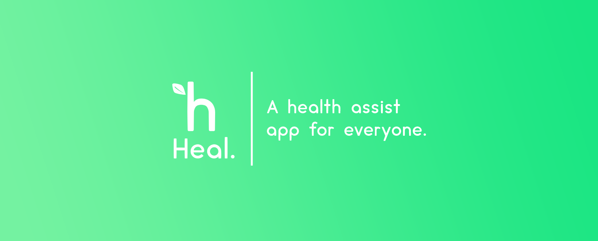

# Heal.

### A health assist app for everyone.

## What Heal offers:

- **Body Mass Index**: With BMI, you can get a better idea of whether you should make any changes to your diet or exercise routine in order to stay healthy.

- **Exercises**: A comprehensive catalog of exercises which suit you along with a tracker.

- **Meditation Tracking**: Meditation has countless benefits for both the mind and body. Our meditation tracker makes it easy to keep track of your practice and see the positive impact it has on your daily life.

- **Nutrition Planning**: Find the perfect healthy meal with our comprehensive nutrition search.

## Progress:

- BMI Calculator ✅️
- Exercises Catalog ✅️
- Exercise Category Listing ✅️
- Nutrition Planning [in progress...]
- Meditation Tracking [future plan...]

### Hackathon & Team Information

This project is currently a submission for [HackNITR 4.0](https://hacknitr.com) round 1 hosted on [devfolio](https://devfolio.co/projects/heal-c43c).

Team: `Cool Potatoes`

Members:

- [Prince Raj](https://devfolio.co/@Prince2347X) : Flutter developer for the entire app.
- [Shreyas Gaddam](https://devfolio.co/@shreydan) : UI and Assets design.

